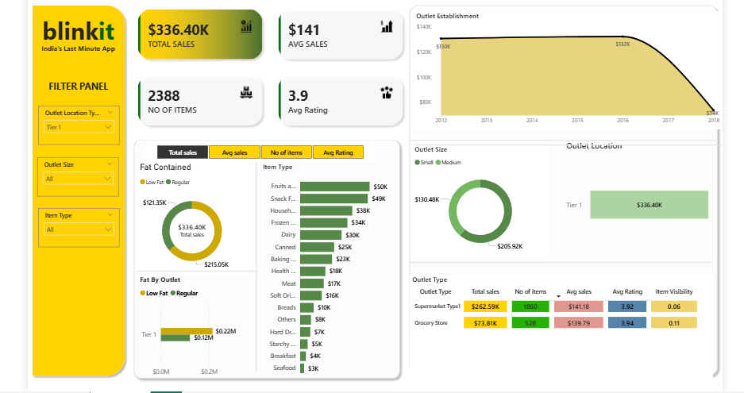

# 🛒 Blinkit Sales Analysis | Power BI Dashboard

## 📌 Project Overview

This project presents an end-to-end **sales performance analysis for Blinkit** using **Microsoft Excel and Power BI**. The objective is to transform cleaned grocery retail data into an interactive dashboard that helps users understand overall sales performance, customer product preferences, outlet characteristics, and business trends.

The Power BI report focuses on key business dimensions such as **item type, fat content, outlet size, outlet location, outlet type, and outlet establishment year**.

---

## 🎯 Business Problem

Retail businesses generate large volumes of transaction and product-level data, but raw data alone does not provide actionable information. Management needs a simple way to monitor sales performance and understand which products and outlet characteristics contribute most to revenue.

This project answers questions such as:

- What is the overall sales performance of the business?
- Which item categories generate the highest sales?
- How do Low Fat and Regular products compare?
- Which outlet location tier contributes the most sales?
- Which outlet size performs best?
- Which outlet type generates the highest revenue?
- How has sales performance varied by outlet establishment year?
- What is the average product rating?

---

## 🎯 Project Objectives

- Analyze Blinkit retail sales data using descriptive analytics.
- Build meaningful KPIs for management reporting.
- Compare product performance across categories.
- Evaluate outlet performance by size, location, type, and establishment year.
- Create an interactive Power BI dashboard with slicers for flexible analysis.
- Convert raw data into clear business insights that support decision-making.

---

## 📊 Key Performance Indicators

Based on the cleaned dataset used in this project:

| KPI | Result |
|---|---:|
| **Total Sales** | **$1.20M** |
| **Average Sales** | **$140.99** |
| **Total Records / Items Sold** | **8,523** |
| **Unique Item Identifiers** | **1,559** |
| **Average Rating** | **3.92 / 5** |
| **Total Outlets** | **10** |

---

## 🗂️ Dataset Information

The cleaned dataset contains **8,523 records and 13 columns**.

| Column | Description |
|---|---|
| **Fat Content** | Product fat category: Low Fat or Regular |
| **Item Identifier** | Unique identifier assigned to each item |
| **Item Type** | Product category such as Dairy, Snacks, Household, etc. |
| **Outlet Year** | Year in which the outlet was established |
| **Outlet Identifier** | Unique identifier assigned to each outlet |
| **Outlet Location Type** | Geographic tier of the outlet: Tier 1, Tier 2, or Tier 3 |
| **Outlet Size** | Outlet size: Small, Medium, or High |
| **Outlet Type** | Grocery Store or Supermarket type |
| **Item Visibility** | Visibility percentage of the item within the outlet |
| **Item Weight** | Weight of the item |
| **Sales** | Sales generated by the item |
| **Rating** | Product/customer rating |
| **Outlet Age** | Calculated age of the outlet |

---

## 🧹 Data Cleaning & Preparation

Before building the Power BI dashboard, the data was cleaned and prepared in Excel.

Main preparation steps included:

1. Reviewed column names and data types.
2. Standardized categorical values, including **Fat Content**.
3. Checked missing and inconsistent values.
4. Validated numeric columns such as Sales, Rating, Item Weight, and Item Visibility.
5. Reviewed outlet-level dimensions such as Size, Type, and Location.
6. Created/validated the **Outlet Age** field for additional analysis.
7. Loaded the cleaned dataset into Power BI for modeling and visualization.

---

## 📈 Dashboard Analysis

The Power BI dashboard contains the following major visuals and analytical sections:

### 1. KPI Summary
Provides a quick overview of the most important business metrics, including **Total Sales, Average Sales, Number of Items, and Average Rating**.

### 2. Fat Content Analysis
A donut chart compares sales contribution from **Low Fat** and **Regular** products.

### 3. Fat Content by Outlet
A clustered bar chart shows how sales from different fat-content categories vary across outlets.

### 4. Item Type Analysis
A bar chart compares sales across product categories such as Fruits & Vegetables, Snack Foods, Household, Frozen Foods, Dairy, and others.

### 5. Outlet Establishment Trend
A line chart analyzes sales performance according to the year in which outlets were established.

### 6. Outlet Size Analysis
A donut chart evaluates sales contribution from **Small, Medium, and High** outlet sizes.

### 7. Outlet Location Analysis
A funnel visual compares sales performance across **Tier 1, Tier 2, and Tier 3** outlet locations.

### 8. Outlet Type Analysis
A detailed matrix/pivot-style visual compares Grocery Stores and different Supermarket types.

### 9. Interactive Filters
The report includes slicers for:

- Metric selection
- Outlet Location Type
- Outlet Size
- Item Type

These filters allow users to perform focused analysis without modifying the report.

---
## 📊 Dashboard Preview


## 🔍 Key Insights

The analysis produced several useful findings:

- **Low Fat products generated approximately $776.32K**, contributing about **64.6% of total sales**.
- **Regular products generated approximately $425.36K**.
- **Fruits and Vegetables** was the highest-performing item category with approximately **$178.12K** in sales.
- **Snack Foods** was a close second with approximately **$175.43K** in sales.
- **Tier 3 outlets generated the highest sales**, approximately **$472.13K** or **39.3% of total sales**.
- **Medium-sized outlets contributed the most sales**, approximately **$507.90K**.
- **Supermarket Type1** was the strongest outlet type, generating approximately **$787.55K**, or around **65.5% of total sales**.
- Outlets established in **2018** recorded the highest combined sales at approximately **$204.52K**.
- The overall average rating was approximately **3.92 out of 5**, indicating generally positive customer feedback.

---

## 💡 Business Recommendations

Based on the analysis, Blinkit could consider the following actions:

- Maintain strong inventory availability for **Fruits & Vegetables** and **Snack Foods**, as these categories generate the highest sales.
- Continue prioritizing **Low Fat products**, which account for the majority of revenue in the dataset.
- Study the operating model of **Tier 3** and **Medium-sized outlets** to identify practices that could be applied elsewhere.
- Focus expansion and optimization efforts on the **Supermarket Type1** format because it contributes the largest share of sales.
- Review lower-performing item categories and outlets to identify opportunities for assortment changes, pricing improvements, or promotional campaigns.
- Use dashboard filters regularly to compare performance across outlet segments and detect changes in customer demand.

---

## 🛠️ Tools & Technologies

- **Microsoft Excel** – Data cleaning and preparation
- **Power BI Desktop** – Data modeling, DAX calculations, visualization, and dashboard development
- **Power Query** – Data transformation and loading
- **GitHub** – Project documentation and portfolio hosting

---

## 📁 Recommended Repository Structure

```text
Blinkit-Sales-Analysis/
│
├── README.md
├── data/
│   └── Clean_data.xlsx
│
├── powerbi/
│   └── blinkit_powerbi_project.pbix
│
└── images/
    └── dashboard.png
```

> For a cleaner GitHub repository, rename the uploaded files before pushing them, for example `Clean_data.xlsx` and `blinkit_powerbi_project.pbix`.

---

## 🚀 How to Use This Project

1. Clone or download this GitHub repository.
2. Open the cleaned Excel file from the `data` folder to review the source data.
3. Open `blinkit_powerbi_project.pbix` using **Power BI Desktop**.
4. Refresh the dataset if necessary.
5. Use the dashboard slicers to explore performance by outlet location, outlet size, item type, and selected metrics.

---

## 🧠 Skills Demonstrated

This project demonstrates practical data analyst skills in:

- Data Cleaning
- Data Transformation
- Data Modeling
- DAX / KPI Development
- Exploratory Data Analysis
- Retail Sales Analysis
- Data Visualization
- Dashboard Design
- Business Insight Generation
- Power BI Reporting

---

## 📌 Project Summary

This Blinkit Power BI project converts grocery retail data into an interactive business dashboard. It helps stakeholders understand **what is selling, where sales are strongest, which outlet formats perform best, and how product and outlet characteristics influence revenue**.

The project is suitable for a **Data Analyst portfolio** because it demonstrates the complete analytical workflow from cleaned data to dashboard development, insight generation, and business recommendations.

---

## 👩‍💻 Author

**Nandini Jain**  
Aspiring Data Analyst  
Skills: Excel | SQL | Power BI | Data Visualization | Data Analysis

---

### ⭐ If you find this project useful, consider giving the repository a star!
